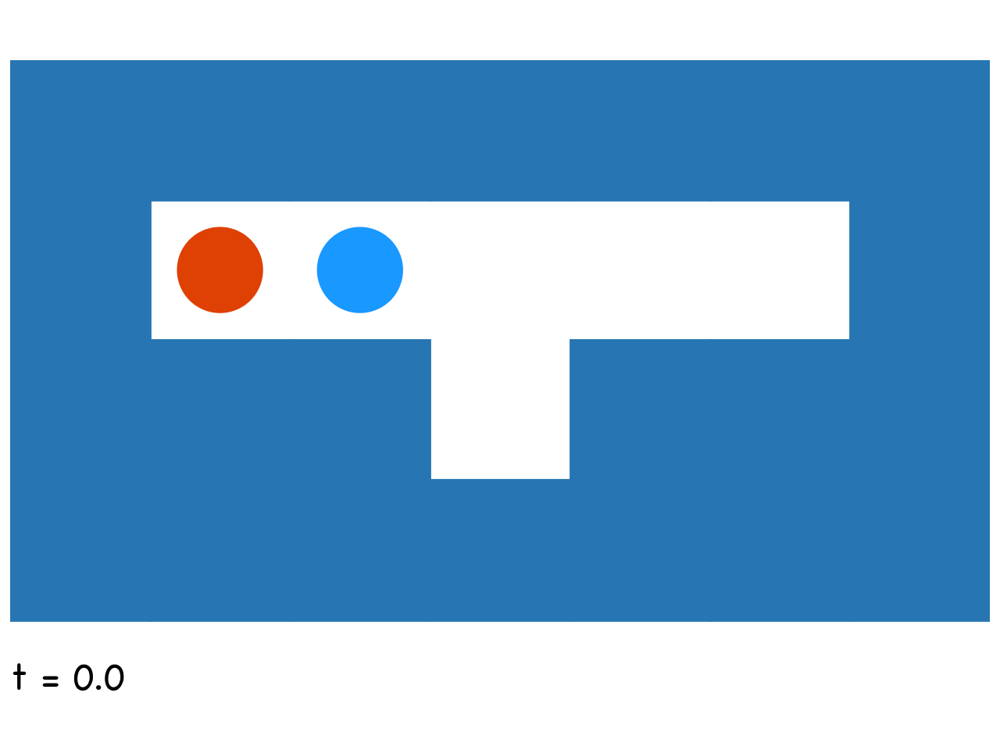
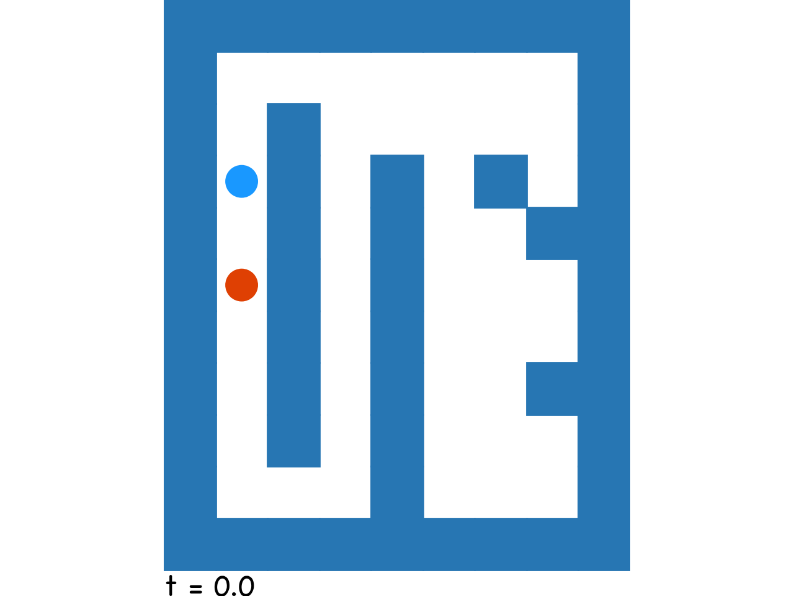
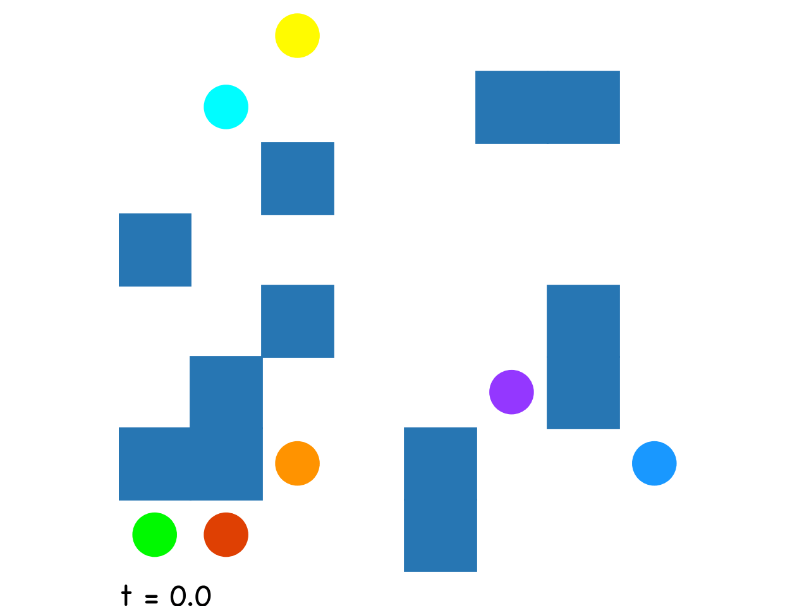
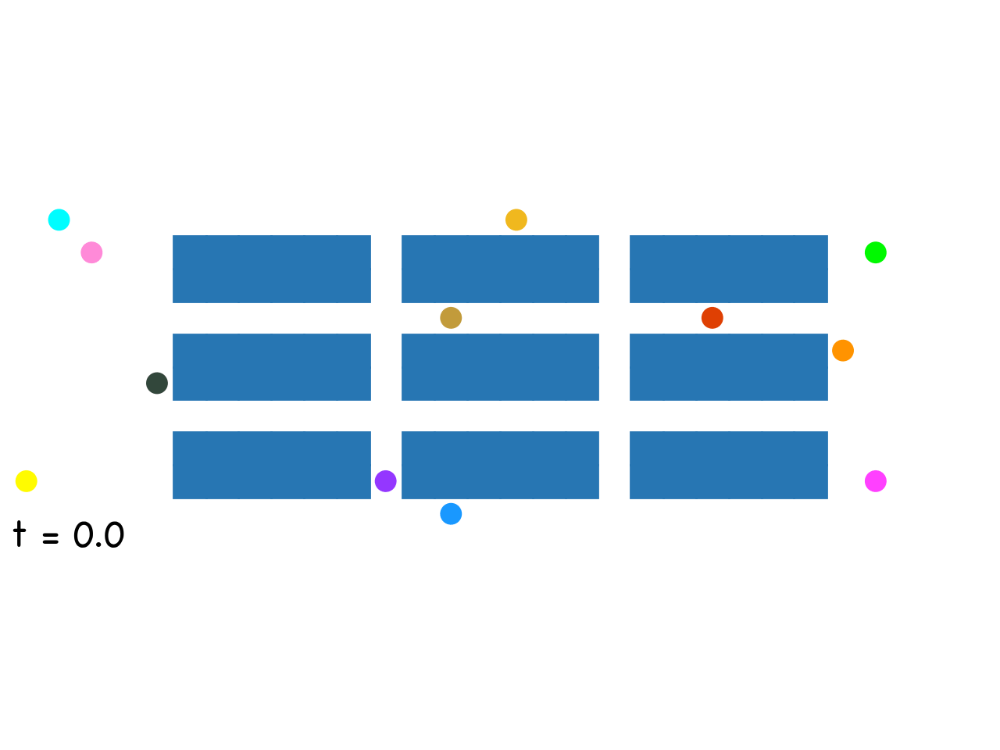

# Multiagent path finding algorithms
Задача многоагентного планирования (`MAPF`) - это задача поиска оптимальных путей из стартовых точек в конечные на графе. Пути при этом не должны конфликтовать: считается, что в каждый момент времени по этому пути будет идти агент, эти агенты не должны пересекаться.   
Проект реализует алгоритмы для решения задачи `MAPF` на 4-связных сетках, в каждый момент времени агент может либо пройти в соседнюю клетку, либо остаться в своей. Например на картинке показано, какие будут оптимальные пути для данных агентов на данной карте:  

   

В проекте реализованно несколько алгоритмов для решения `MAPF` (`CBS`, `CBSPC`, `CBS-h`, `CBSPC-h`).  
Вы можете запускать эти алгоритмы на собственных картах через командную строку.  
Также в ноутбуке `Tests/showcase.ipynb` находятся результаты тестирований этих алгоритмов на разных картах.  

## Установка и запуск

Сначала нужно склонировать репозиторий и перейти в папку с проектом

```
git clone https://github.com/Artem-Goldenberg/MultiAgentPathFinding
cd MultiAgentPathFinding
```

Все зависимости стандартные (`numpy`, `pandas` и тд), они описаны в `requirements.txt`.  
Если чего-то не хватает или устанавливаете в чистое окружение, то можно сделать

```
pip install -r requirements.txt
```

После этого надо собрать расширение для Питона, написанное на C (все файлы хранятся в папке `CExtension`).    
Можно создать библиотеку прямо в папке проекта, для этого подготовлен файл `setup.py`.

```
python setup.py build_ext --inplace
```

Теперь можно запускать основное приложение через `main.py`.

```
python main.py <algorithm> <filepath> <flag>
```

В качестве `<algorithm>` можно выбрать:  
    - `cbs` - обычные Conflict Based Search без улучшений.  
    - `cbs_pc` - CBS с приоритезацией конфликтов.  
    - `cbsh` - CBS c допустимой эвристикой.  
    - `icbs` - CBS с эвристикой и приоритезацией вместе, самая быстрая версия.  

`<filepath>` - это путь к файлу с картой в текстовом формате (например `.txt`)
<details closed>
<summary>Формат карты</summary>
<br>
* первая строчка: n m - количество строк и столбцов в карте через пробел.     
* следующие n строчек: сама карта `.` - путь, `@` - стенка, все символы ставятся через пробел.    
* строчка после карты: k - количество агентов.    
* следующие k строчек: $S_i$ $S_j$ $G_i$ $G_j$ - координаты начала и цели для каждого агента СНАЧАЛА СТРОЧКА, ПОТОМ СТОЛБЕЦ.  
[Пример карты](./Tests/instances/exp0.txt).  
</details>

В качестве `<flag>` можно передать `-d` или `--draw` и после него опционально указать путь для `.gif` файла. Тогда программа сохранит `.gif` файл с анимацией решения по указанному пути. Если не передавать путь, то файл создастся в текущей директории.

Пример вызова (можно передавать свою карту, но будут работать карты и из папки `instances`)

```
$ python main.py cbsh 'Tests/instances/test_46.txt' -d 'my_animation.gif'

Testing 'Algorithms.cbsh.solve' algorithm on the map 'Tests/instances/test_46.txt':
Saving solution animation to 'my_animation.gif'

Found solution with cost = 57
Expanded nodes: 13
CPU time = 0.015098999999999752 seconds, Wall time = 0.015112161636352539 seconds
Agent paths:
[0] = (1, 7) -> (2, 7) -> (3, 7) -> (3, 6) -> (3, 5) -> (3, 4) -> (3, 3) -> (2, 3) -> (1, 3) -> (1, 4) -> (0, 4) -> cost = 10
[1] = (7, 6) -> (6, 6) -> (5, 6) -> (5, 5) -> (5, 4) -> (5, 3) -> (4, 3) -> (3, 3) -> (2, 3) -> cost = 8
[2] = (5, 5) -> (5, 4) -> (5, 3) -> (6, 3) -> cost = 3
[3] = (1, 1) -> (2, 1) -> (3, 1) -> (3, 1) -> (3, 2) -> (4, 2) -> (5, 2) -> (6, 2) -> (7, 2) -> (7, 3) -> cost = 9
[4] = (0, 7) -> (1, 7) -> (2, 7) -> (2, 6) -> (2, 5) -> (3, 5) -> (3, 4) -> (4, 4) -> (4, 3) -> (4, 2) -> (4, 1) -> (4, 0) -> cost = 11
[5] = (2, 6) -> (2, 5) -> (3, 5) -> (4, 5) -> (5, 5) -> (5, 6) -> (6, 6) -> (7, 6) -> (7, 5) -> (7, 4) -> cost = 9
[6] = (2, 0) -> (3, 0) -> (4, 0) -> (4, 1) -> (4, 2) -> (4, 3) -> (4, 4) -> (5, 4) -> cost = 7
------------------------------------------------------------------------------------------------
```

Выведет найденные пути и сохранит файл 'my_animation.gif` в текущую директорию

Для быстрой помощи можно вызвать `python main.py -h`

## Eще примеры решений (ну зачем-то то я делал графику)







## Источники

- Boyarski, E.; Felner, A.; Stern, R.; Sharon, G.; Tolpin, D.; Betzalel, O.; and Shimony, S. 2015. ICBS: Improved conflict-based search algorithm for multi-agent pathfinding. In Proceedings of the International Joint Conference on Ar- tificial Intelligence, 740–746. https://www.ijcai.org/Proceedings/15/Papers/110.pdf

- Ariel Felner ; Jiaoyang Li ; Eli Boyarski ; Hang Ma Liron Cohen T. K. Satish Kumar Sven Koenig. Adding Heuristics to Conflict-Based Search for Multi-Agent Path Finding https://www2.cs.sfu.ca/~hangma/pub/icaps18.pdf

- Guni Sharon ; Roni Stern ; Ariel Felner ; Nathan R. Sturtevant. Conflict-based search for optimal multi-agent pathfinding https://www.bgu.ac.il/~felner/2015/CBSjur.pdf

- moving ai maps: https://www.movingai.com/benchmarks/mapf.html

## Работали над проектом
 Петров Леонид, Ибрагимов Артем и Никитин Максим
